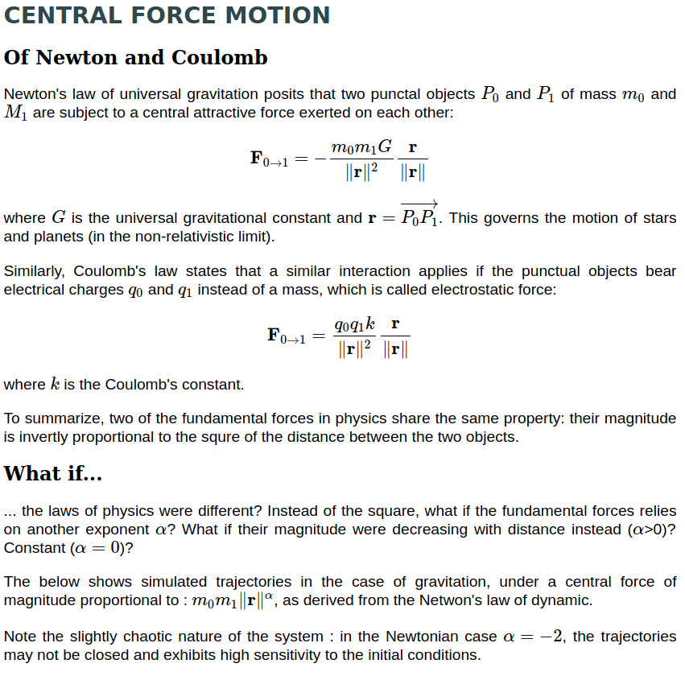
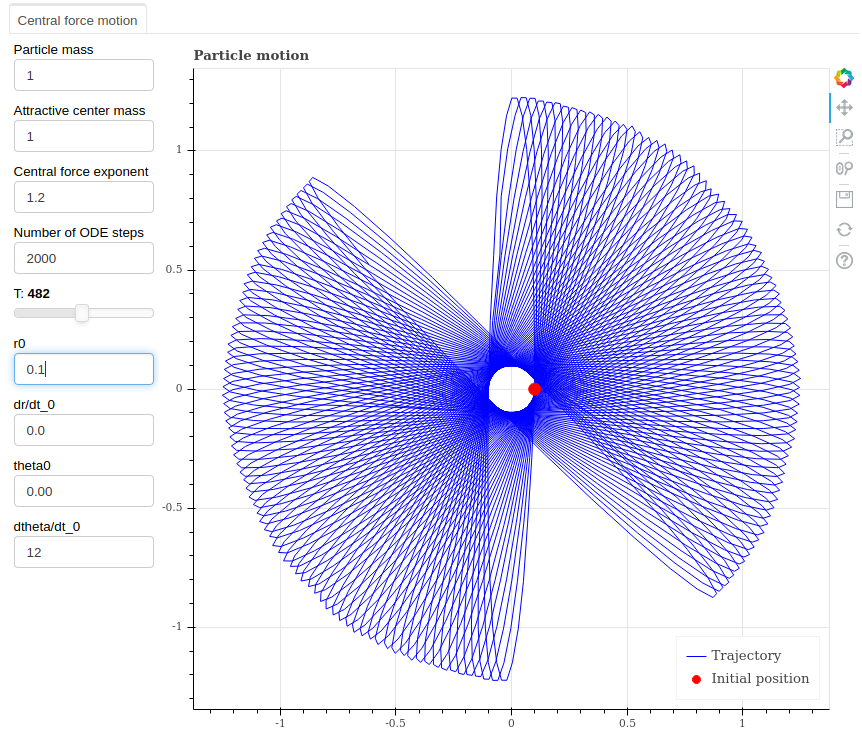
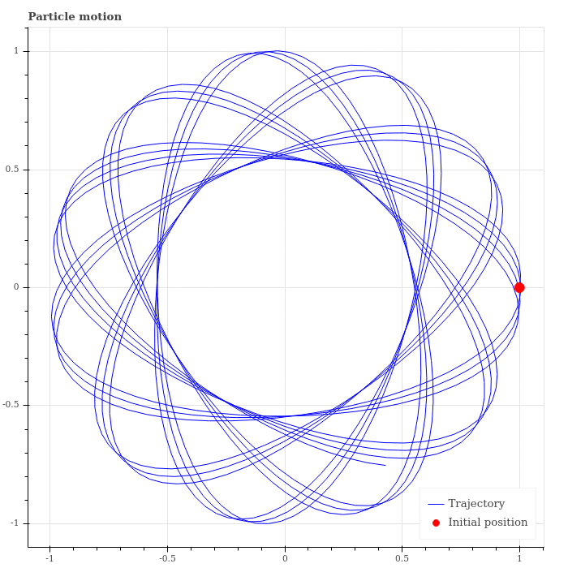
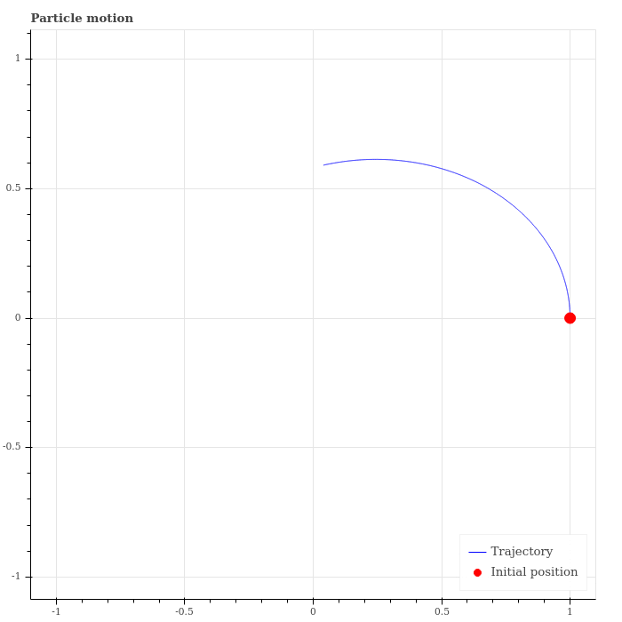

# physics_motion

**To run the app** :
* clone the repo
* run bokeh serve --show central_force_app/

Newton's law of universal gravitation posits that the gravitational interaction between two punctual masses is inversely proportional to the square of their Euclidean distance. This app helps you explore what would the trajectory look like if the laws of physics would change!
 

     
### Particle trajectory for varying exponent 

## Gravitation inversely proportional to distance

### Particle trajectory for varying initial radial speed 

### Particle trajectory through time

